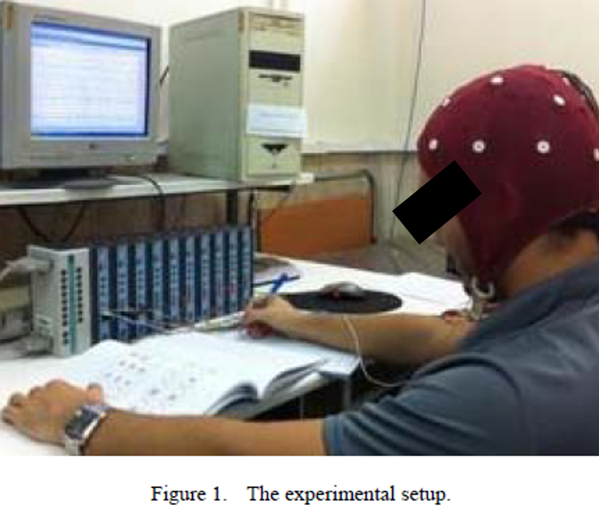
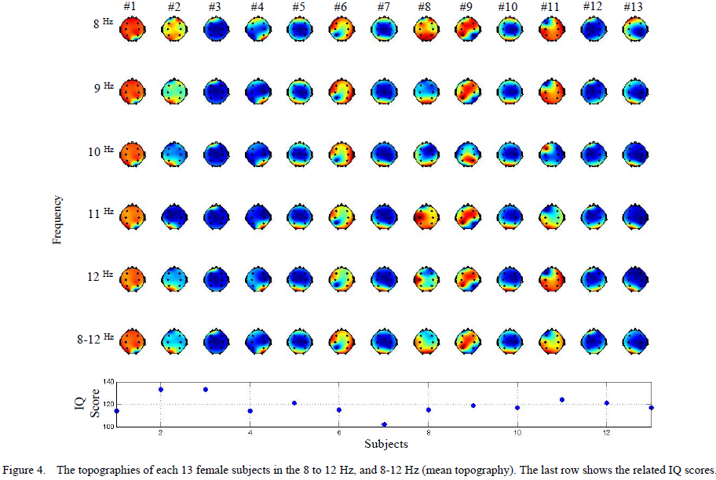

# EEG Alpha Band Power Topographies of Educated Subjects while Solving an IQ Test: A Case Study

Human brain is the most extraordinary and exceptional part of the matured nervous system which allows us to perceive, act, learn, and remember. There are some subjective-based indices to quantify the intelligence or the brain activity level such as IQ. Intelligence Quotient (IQ) is a score obtained from numerous various standardized tests developed for measuring a person’s cognitive abilities or intelligence relative to others of approximately the same age. There are some classification systems that are widely used to determine a person’s mental or intellectual disability based on psychometric tests. Some of the IQ tests require a minimum degree of cognitive level to evaluate a person’s intelligence whereas others are simplified and have minimal linguistic content and are called culture-fair tests which are suitable for mentally retarded people. However, the ultimate challenge of biological and biomedical scientists is to understand the biological basis of intelligence and to identify objective-based indices for measuring the intelligence. Therefore, many researchers focused on measuring the brain activities while different subject tasks of limb movement, mental task, etc through brain imaging techniques such as Electroencephalography (EEG), magneto-encephalography (MEG), functional magnetic resonance imaging (fMRI), positron emission tomography (PET), and near infrared spectroscopy (NIRS).

# How to cite
* F. Afdideh, et al., “Gender Differences in EEG Alpha Band Power Topographies of Educated Subjects while Solving an IQ Test: A Case Study”, to be published.
